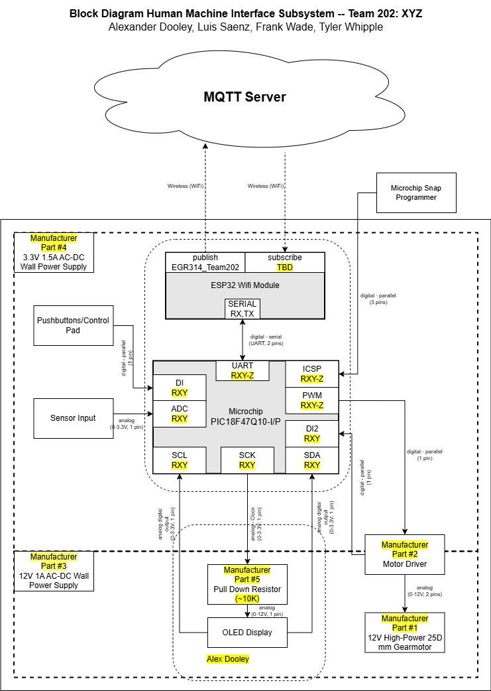

## Below is the block diagram for our HMI subsystem

 

### Final Design

No significant changes were required in the final design for this subysystem's communication.  Only some initial features that ended up getting removed from the board and block diagram so it could focus on the needed parts for the OLED to fully display the messaging system to the user.
