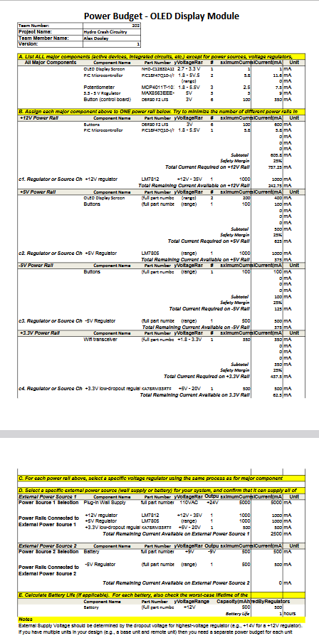

## Below is the schematics for our HMI subsystem

## Power Budget

Below is the power budget used to determine the necessary supply voltages for this particular subsystem.

The power budget allows the team to coordinate their micro-controllers with each other. By gathering the information above, team 202 can decide whose board will initiate team power, as well as derive how much power the exhibit will consume. By calculating our consumption we can determine how much power we shall need as a team and how long our exhibit can operate.

In conclusion, the power budget is essential. If one is a part of a team, the team can append the system easier knowing the power consumption of the device being added. Lastly, the budget gives me a quick reference of my power needs and constraints. By estimating my system's maximum power I can choose the most appropriate and capable components to support my system.
